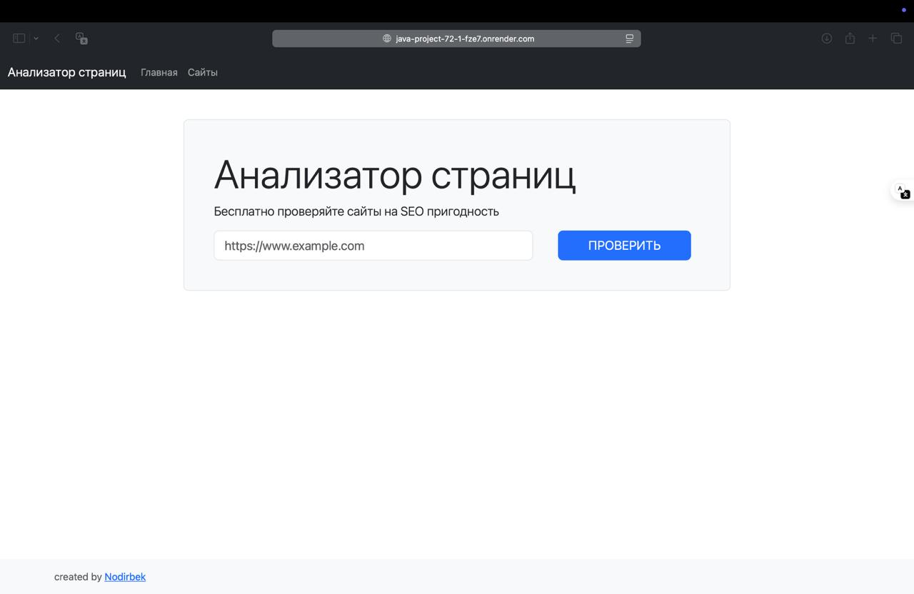
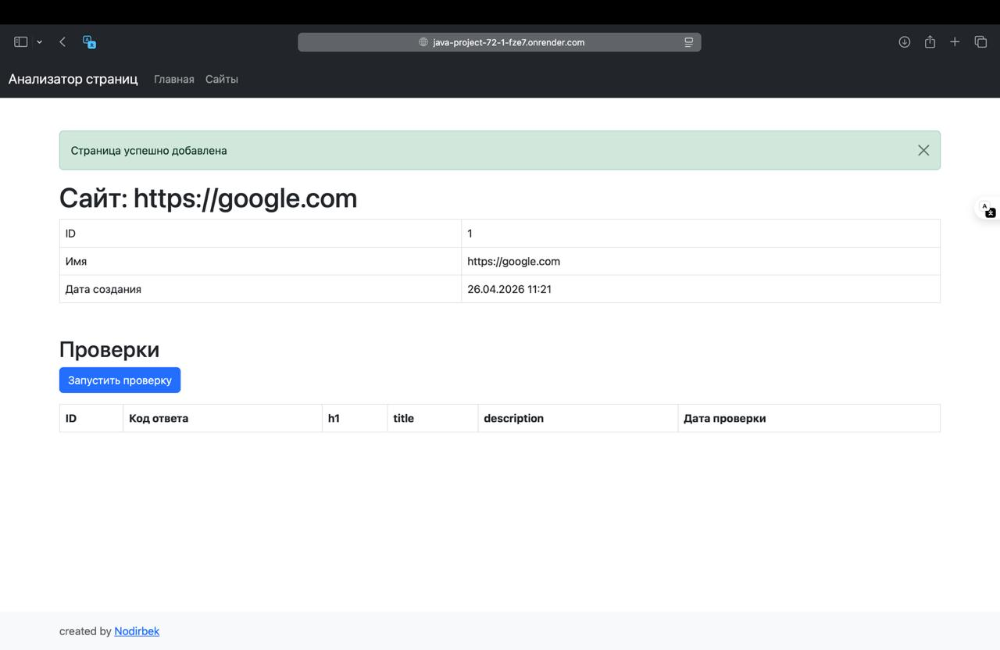
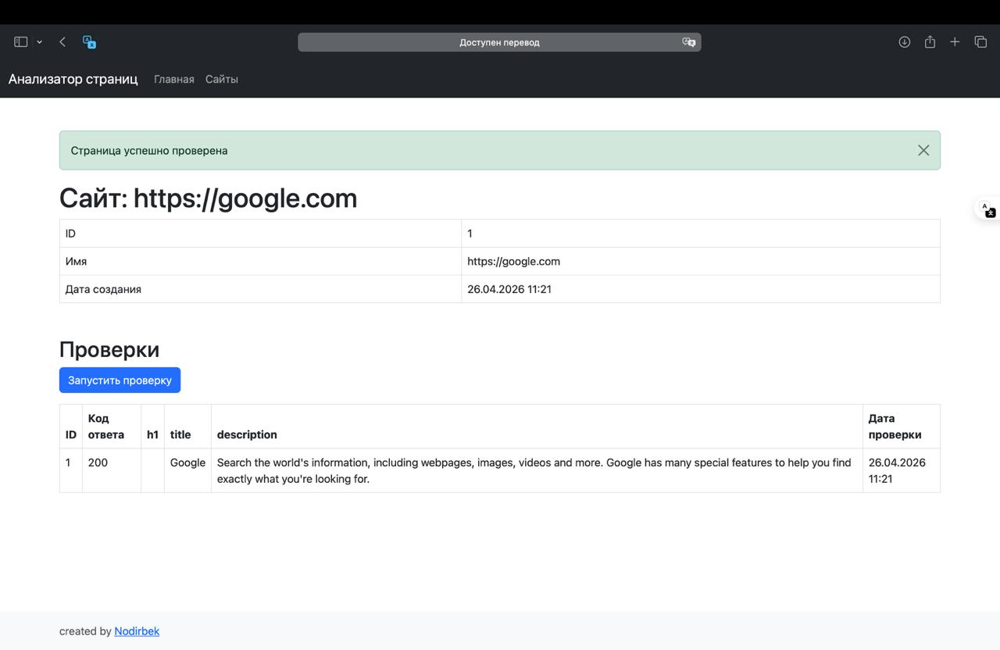
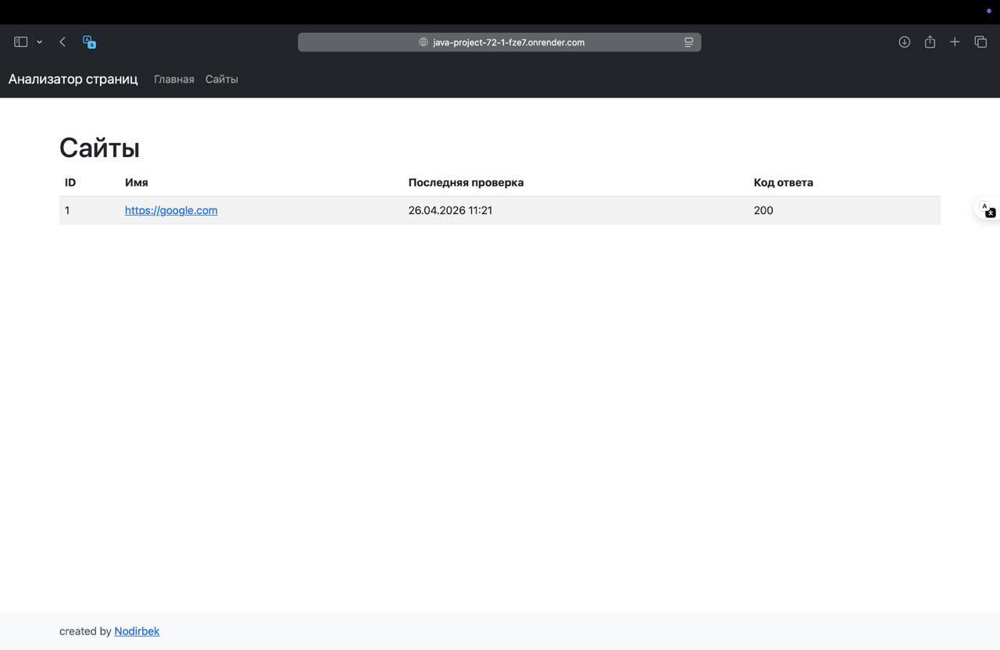

# Page Analyzer — SEO Website Checker 🔍

### Hexlet tests, CI & Code Quality
[](https://github.com/nodirbek9/java-project-72/actions)
[](https://github.com/nodirbek9/java-project-72/actions/workflows/mySonar.yml)
[](https://sonarcloud.io/summary/new_code?id=nodirbek9_java-project-72)

---

## 🌐 Live Demo

**[https://java-project-72-1-fze7.onrender.com](https://java-project-72-1-fze7.onrender.com)**

---

## 📋 Project Description

**Page Analyzer** is a web application for analyzing website SEO readiness.
It checks page availability and collects basic SEO metrics: `<title>`, `<h1>`, `<meta description>`.

The project was implemented as part of **Hexlet (Java Developer)** training with focus on:
- Layered Architecture (Controller → Service → Repository)
- RESTful API design
- Database integration (PostgreSQL + H2)
- Template rendering (JTE)
- Test coverage (JUnit + MockWebServer)
- CI/CD (GitHub Actions + Render)

---

## ✨ Key Features

- ✅ Add URLs for monitoring
- ✅ Check website availability (HTTP status code)
- ✅ Extract SEO metrics (`title`, `h1`, `description`)
- ✅ History of all checks with timestamps
- ✅ Automatic truncation of long values (200 characters)
- ✅ Error handling (4xx/5xx)
- ✅ URL normalization (ignoring path and query parameters)

---

## 🛠 Technologies & Tools

### Backend
- **Java 21** — modern JDK version
- **Javalin 6** — lightweight web framework
- **PostgreSQL** — production database
- **H2** — in-memory database for tests
- **HikariCP** — connection pooling

### Frontend
- **JTE** — type-safe template engine
- **Bootstrap 5** — responsive UI

### HTTP & Parsing
- **Unirest** — HTTP client
- **Jsoup** — HTML parser

### Testing & Quality
- **JUnit 5** — unit tests
- **MockWebServer** — HTTP request mocking
- **JaCoCo** — code coverage
- **Checkstyle** — code style
- **SonarCloud** — static analysis

### DevOps
- **Gradle** — project build
- **GitHub Actions** — CI/CD
- **Render** — deployment
- **Docker** — containerization

---

## 🚀 Installation & Running

### Requirements
- **Java 21** or newer
- **Gradle 8+**
- **PostgreSQL 17** (for production)

### Clone repository
```bash
git clone https://github.com/nodirbek9/java-project-72.git
cd java-project-72/app
```

### Build project
```bash
gradle build
```

### Run locally (H2 in-memory)
```bash
gradle run
```

Application will be available at: **http://localhost:8080**

### Run with PostgreSQL
```bash
export JDBC_DATABASE_URL=jdbc:postgresql://localhost:5432/page_analyzer
export PORT=8080
gradle run
```

---

## 📊 Project Architecture

```
hexlet.code
├── App.java                    # Entry point + routing
├── config/
│   ├── DatabaseConfig.java    # DataSource & migrations
│   └── TemplateConfig.java    # JTE configuration
├── controller/
│   ├── UrlController.java     # URL CRUD endpoints
│   └── UrlCheckController.java # Check endpoints
├── service/
│   ├── UrlService.java        # URL business logic
│   └── UrlCheckService.java   # Check business logic
├── repository/
│   ├── UrlRepository.java     # URL data access
│   └── UrlCheckRepository.java # Check data access
├── model/
│   ├── Url.java               # URL entity
│   └── UrlCheck.java          # Check entity
├── dto/
│   ├── UrlPage.java           # Single URL view
│   ├── UrlsPage.java          # URLs list view
│   └── UrlWithLastCheck.java  # URL + last check
└── util/
    ├── UrlNormalizer.java     # URL normalization
    ├── HtmlParser.java        # HTML parsing
    └── StringTruncator.java   # Text truncation
```

### Key Principles:
- **Separation of Concerns** — each layer has its own responsibility
- **Dependency Injection** — via constructors
- **Single Responsibility** — one class = one responsibility
- **DRY** — reusable utility classes

---

## 🧪 Testing

### Run all tests
```bash
gradle test
```

### Generate coverage report
```bash
gradle jacocoTestReport
```

Report will be available at: `app/build/reports/jacoco/test/html/index.html`

### Check code style
```bash
gradle checkstyleMain checkstyleTest
```

---

## 🎯 Usage Examples

### 1. Add URL


### 2. URLs List


### 3. URL Details and Checks


### 4. Check Result


---

## 📈 CI/CD Pipeline

### GitHub Actions
- ✅ Automatic test execution
- ✅ Code style check (Checkstyle)
- ✅ Code analysis (SonarCloud)
- ✅ Coverage measurement (JaCoCo)
- ✅ Hexlet auto-tests

### Deployment (Render)
- 🚀 Automatic deploy on push to `main`
- 🐘 PostgreSQL database
- 🐳 Docker container

---

## 📝 API Endpoints

| Method | Endpoint | Description |
|--------|----------|-------------|
| GET | `/` | Home page |
| GET | `/urls` | List of all URLs |
| POST | `/urls` | Add new URL |
| GET | `/urls/{id}` | URL details + check history |
| POST | `/urls/{id}/checks` | Run URL check |

---

## 📄 License

This project was created for educational purposes as part of the [Hexlet](https://hexlet.io) course.

---

## 👨‍💻 Author

**Nodirbek**
Java Backend Developer 🚀

---